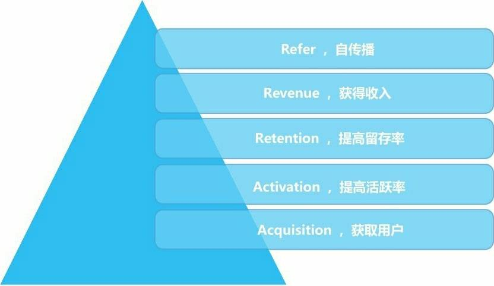
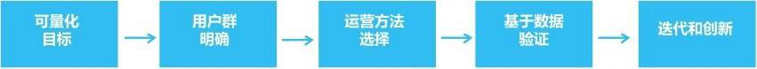

# 《互联网运营之道》- 第2章：运营基础逻辑
互联网运营的基础逻辑也是采用一些常规的解决问题的方法论来解决遇到的问题。常规的方法论有：PDCA 循环， SWOT 分析法， 5W1H 分析法。

## 如何找到目标用户
考虑清楚，
* 目标用户是一群怎样的人。
* 目标用户的数量。
* 我们的产品能满足用户怎样的需求。有明确的定位。

然后去 目标用户 会出现的地方(场景)去寻找用户。

如果发现找不到足够数量的目标用户的原因：
* 不够了解目标用户。找目标用户的地方不对。
* 目标用户的数量太小。
* 产品做的不好，或者是伪需求。

## 做产品的逻辑
用精益的方式做产品：从细分市场做，满足一小部分用户的需求，快速做出最小化可用产品，快速试错，调整。

在做产品的过程中，多和用户交流沟通，以及分析用户行为数据，来足够了解你的目标用户。站在他们的角度去思考设计产品。

产品的操作要尽可能的简单。核心流程的操作步骤越短，操作越容易，越好。

## 常见的运营手段
常见的运营手段包括三种：内容运营，活动运营和用户运营。

内容运营：用内容来打动用户。活动运营：通用活动来吸引新用户，或提供老用户的活跃度。用户运营：增加活跃用户的数量。

## AARRR 模型

AARRR 模型指： 获取用户(Acquisition) -> 提高活跃度(Activation) -> 提高留存(Retention) -> 获得收入(Revenue) -> 自传播(Refer) 的过程。

获得收入这块分为两类： 前向收费（To C: 向用户收费）和后向收费(To B: 向公司收费)。

自传播 可以理解为 “病毒式” 营销。

## 运营的基本流程
运营的基本流程可采用 PDCA 循环。 PDCA 指 Plan(计划), Do(执行), Check(检查) 和 Action(处置检查结果)。具体来说，就是制定可量化的目标，然后去执行，检查执行的结果，对检查结果进行处理： 对成功的建议加以肯定，予以标准化；对失败的教训进行总结，避免重蹈覆辙。循环这个过程。

运营的基本流程针对 PDCA 循环做了如下图的变化  

