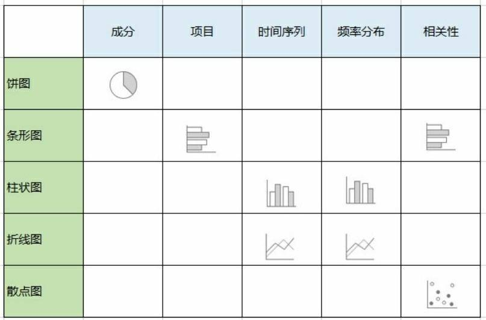

# 《互联网运营之道》读书笔记 - 第6章：通过数据找本质

## 数据统计的原则
* 业务导向。 数据统计的目的是找工作中的关键点，从而提升业务成绩。
* 数据清晰完整。数据清晰完整包括四要素：
  * 数据的定义清晰，没有歧义。
  * 计算规则准确。
  * 数据来源明确。
  * 单位量级别清楚。
* 数据可追溯，可对比。数据需要统计一段时间，这样追溯对比过去的数据，进行分析。只统计一次的孤立数据，意义不大。

## 数据分析五步法
1. 定义问题。
1. 收集信息。
1. 选取分析方法。确定需要哪些数据字段，用什么分析算法，用什么软件，用什么方式呈现结果。
1. 数据提取整理。
1. 分析结果，给出结论。

## 抽样的方法
常见的抽样方法有四种：
* 随机抽样。
* 系统抽样。按照某个规则抽样，比如，给数据编号，每隔k个编号抽一个。
* 分层抽样。将总体按照某个特征分层。每层内随机抽。
* 整群抽样(又称聚类抽样)。将总体分成若干个互不交叉，重复的集合，称为群。然后随机选择一个群，做为样本。

抽样关注的指标
* 众数。出现最多的数。
* 中位数。数据排序后，处于中间的值。
* 平均值。

## 选择合适的数据图表
通过确定需要表达什么信息，来决定选择什么类型的图表。见下图：

## 常见的数据统计平台
* 网站分析工具
  * [谷歌统计](http://www.google.cn/intl/zh-CN_ALL/analytics/index.html)
  * [百度统计](http://tongji.baidu.com/)
  * [CNZZ](http://www.cnzz.com/)
  * [Alexa](www.alexa.com/)
* App数据平台
  * [App Annie](https://www.appannie.com/cn/)
  * [友盟](http://www.umeng.com/)
  * [Flurry](http://www.flurry.com/)
* 趋势分析工具
  * [百度指数](http://index.baidu.com/)
  * [谷歌趋势](www.google.cn/trends/)
* 在线调查工具
  * [麦客](http://www.mikecrm.com/)
  * [腾讯问卷](http://wj.qq.com/)
  * [问卷网](http://www.wenjuan.com/)
